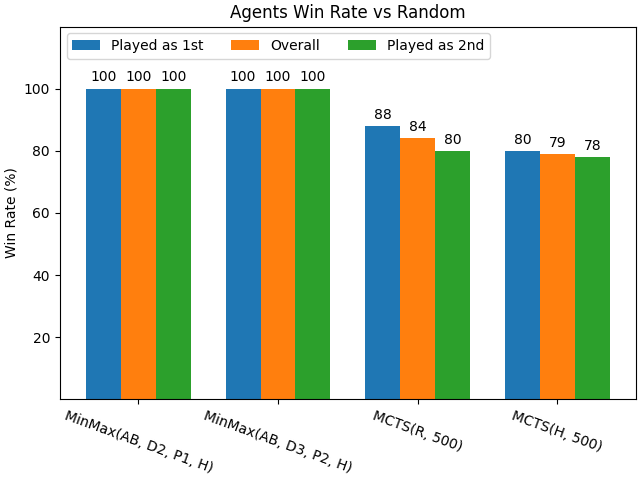
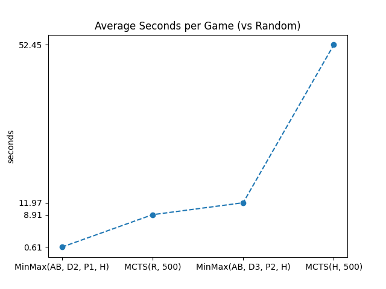

# Computational Intelligence - Quixo
# Authors:
- Alexandro Buffa - S316999

## Description
The game Quixo is a Tic-Tac-Toe variant, played on a five-by-five board of cubes with two players or teams. On a player's turn, they select a blank cube or a cube with their symbol on it that is at the edge of the board. If a blank cube was selected, the cube is turned to be the player's symbol (either an X or O). The game ends when one player gets five in a row.

## What I've Done
- Minmax
  - Features:
    - Depth-Limited
    - Alpha-Beta Pruning
    - Hash-Tables
    - Different Pruning Levels:
      - Pruning lvl 0 - No Pruning, at each node consider all possible moves
      - Pruning lvl 1 - At each node consider only the moves that land on different boards (default)
      - Pruning lvl 2 - At each node consider only the moves that land on different boards and that are not symmetric to each other (from this level onwards, the tradeoff between time wasted in computing the symmetries and the time saved in the search is not worth it)
      - Pruning lvl 3 - All of the above and filter also board that have been already visited on a higher level (not really that useful since we limit to a depth of 3, so there really is not a chance for a cycle to happen) 
- Montecarlo Tree Search
  - Random
  - w/ heuristic
- QLearning
  - An early attempt that was not promising, so I decided to not pursue it further. I left the code in the repo but I believe it is not working properly.

## Navigate through the code

- `custom_game.py`: Wrapper around Game class, with some utility methods and symmetry (canonical representation) handling
- `minmax.py`: Minmax implementation
- `mcts.py`: MonteCarlo Tree Search implementation
- `__main__.py`: containis the code to perform the evaluation

## Results obtained vs Random

|                    Agent                          | Games | Win Rate (%) | Average Time per Game (s) | Average Time per Move (s) | Total Number of Moves |
|:-------------------------------------------------:|:-----:|:------------:|:-------------------------:|:-------------------------:|:---------------------:|
|   MinMax(AB,D2,P1): αβ + Depth 2 + Pruning lvl 1  |  100  |      100     |            0.61           |            0.07           |          831          |
|   MinMax(AB,D3,P2): αβ + Depth 3 + Pruning lvl 2  |  100  |      100     |           11.97           |            1.47           |          816          |
|      MCTS(R500): 500 Games with Random Moves      |  100  |      84      |            8.91           |            0.90           |          985          |
|        MCTS(H500): 500 Games with Heuristic       |  100  |      79      |           52.45           |            4.42           |          1186         |

## Possible Improvements

- [ ] Minmax w/ RankCut
- [ ] Minmax w/ Singular Moves (should be easy and fast-enough using Hash Tables)
- [ ] Parallelization both on Minmax and MCTS
- [ ] Lookup Tables for starting positions